/// include_threejs

# 3D Underwater Maps
*April 2020*

*Note: Click, drag, and scroll to move around the 3d scene above. Height has been multiplied by a factor of 5 to make it more interesting.*

*Note: Ideally, I'd assume you would put together your own RGB-DEM tiles using some compiled global relief data instead of doing it in this roundabout way. But whatever, read on and have a laugh if you actually know what you're doing! Code can be found [here](https://github.com/vulkd/hydroxy).*

/// tos

---

I spotted a [music visualization](https://www.youtube.com/watch?v=2ydmSr_ajQ4) on Youtube that looked like it could be an underwater section in a video game or aquatic synthwave universe. Around the same time a fun three.js/mapbox mash-up [three-geo](https://github.com/w3reality/three-geo) came to my attention. Combining the resulting inspiration from both discoveries, I dived in and had a harpoon at doing some underwater modelling.

While we know a fair bit about Earth's terrestrial elevation, [hyposometry](https://en.wikipedia.org/wiki/Hypsometry), comparatively little is known about it's [bathymetry](https://en.wikipedia.org/wiki/Bathymetry). [Global relief models](https://en.wikipedia.org/wiki/Global_relief_model) attempt to combine both types of elevation regardless of water or ice coverage. Bathymetric surveying has come a long way from lowering cables into the ocean - now tech such as [multibeam](https://en.wikipedia.org/wiki/Multibeam_echosounder) SONAR, [measuring gravitational anomalies](https://academic.oup.com/gji/article/83/1/263/570088), and LIDAR (though not so much) are tools of the trade.

Webmaps with the 3d-perspective capabilities that let the user intuitively view mountains etc. don't include the ocean floor in their 3d models, even though there's a wealth of [data out there](https://maps.ngdc.noaa.gov/viewers/bathymetry/) *(Understandably, high-resolution bathy data isn't available for most of the sea floor. Without new tech, it would require a monumental - some might say impossible - effort on humanities part to map the ocean's elevation to the same level of detail as we have on land)*.

*Note: There seems to have been [a push](https://github.com/AnalyticalGraphicsInc/cesium/pull/6047) to add subterranean and submarine capabilities to Cesium a while ago.*

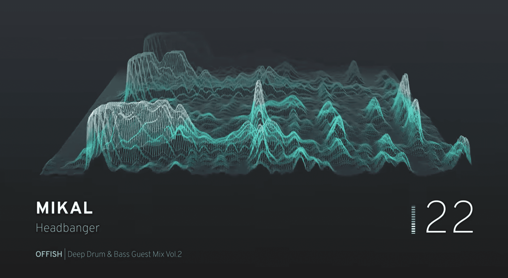

---

## Map Tiling
Map tiles come in two forms - raster (images) and vector (data with coordinates attached). Both can also be used (ie: 'hybrid' satellite maps). For an easy explanation see [this Maptiler publication](https://www.maptiler.com/news/2019/02/what-are-vector-tiles-and-why-you-should-care/).

Using a [quadtree](https://wiki.openstreetmap.org/wiki/QuadTiles) means a user can move around the map and only render the area they're viewing, and not some impossible umpteenth-pixel image file. It also means that with the 5.65gb of space left on my laptop, I'm not about to generate my own RGB-DEM global relief tileset, so I'll stick with modifying Mapbox's for now. The bounding box of the earth at each zoom level is split into `2^z * 2^z` tiles, each tile represented by it's x/y/z coordinates:

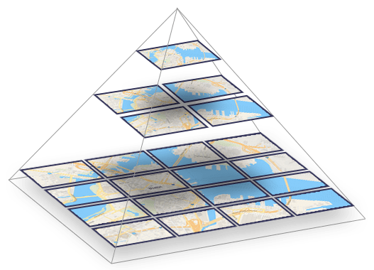

*Image from [Maptiler - What are vector tiles and why you should care](https://www.maptiler.com/news/2019/02/what-are-vector-tiles-and-why-you-should-care/).*

---

## RGB-DEM Tiles
Encoding height data into a tile can be done via mapping a pixel's brightness to metres in grayscale. I'm unaware of any raster DEM data making use of alpha values, or the values of surrounding pixels to contribute to one pixel's height value - in all practical cases unnecessary, as RGB-DEM tiles offer a whopping _**16777216 possible values per pixel**_ (that's base-256!):

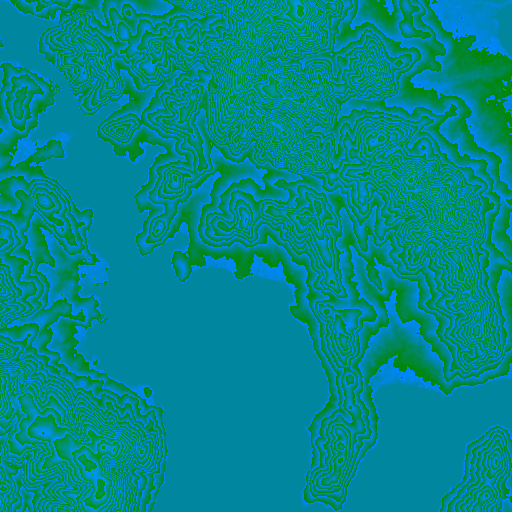

A page from 2011 detailing how engineers at [Klokantech](https://www.klokantech.com/) (Definitely have a look at their projects page!) came up with [an interesting method](https://www.klokantech.com/labs/dem-color-encoding) relying on a Z-order curve to specify shades of blue/purple for water, and land green/red. Mapbox however use a fairly standard  approach with metre increments that relies mainly on green and blue channels. Each pixel's RGB channels can be converted to height in metres like this:

```js
function rgbToHeight (r, g, b) {
	return -10000 + (r * 256 * 256 + g * 256 + b) * 0.1;
}
```

With data from a 512x512px terrain tile, we have a z-axis value for each x/y coordinate on a 512x512px raster tile!

---

## three-geo

Due to mostly standardized tiling systems, matching satellite tiles to terrain tiles is easy - each tile should cover exactly the same area.

[three-geo](https://github.com/w3reality/three-geo) uses data from [Mapbox's terrain tiles](https://docs.mapbox.com/help/troubleshooting/access-elevation-data) to generate a subdivided plane (using triangles, otherwise the result would look a lot like Minecraft) representing the elevation of that area. As far as I'm aware this is a form of [TIN](https://en.wikipedia.org/wiki/Triangulated_irregular_network).

Satellite tile(s) corresponding to the same area are applied to the mesh as a texture, giving us a [great 3d view](https://observablehq.com/@j-devel/hello-3d-geographic-terrains). (I'm trying to be mobile-friendly - if you're not reading this on a phone also have a look [this example](https://w3reality.github.io/three-geo/examples/geo-viewer/io/index.html)).

---

## Modifying RGB-DEM Tiles

Modifying the existing mesh in threejs with bathy data is a possibility, but using terrain tiles is the goal. Before gathering any bathymetry data, I done a quick test.

 - Loaded up an area in three-geo and retrieved the terrain tile URL and response via devtools.
 - Had three-geo to reroute requests for that URL to a local proxy server that responded with the modified tile.
 - Used [jspaint.app](https://jspaint.app/) to make some bitmap edits:

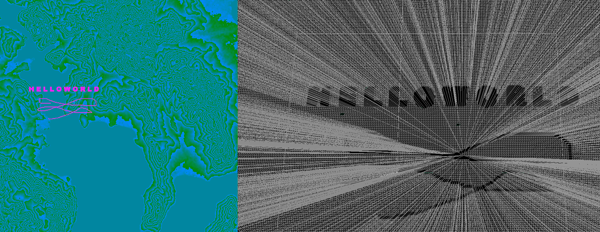

All a bit useless without being able to draw specific values, though! To do that we've got to convert height to the appropriate RGB values using an inverse function, which also works for negative heights for a few km before the red channel loops over (read: future adjustments needed for [Challenger Deep](https://en.wikipedia.org/wiki/Challenger_Deep) [data](https://link.springer.com/article/10.1007/s11001-011-9134-0)).

```js
function heightToRgb (h) {
	const min = 65536;
	const max = 100000;
	const M = (max + h * 10);

	const r = Math.floor(M / min);
	const g = Math.floor(M / 256) - r * 256;
	const b = Math.floor(M) - r * min - g * 256;

	return { r, g, b };
}
```

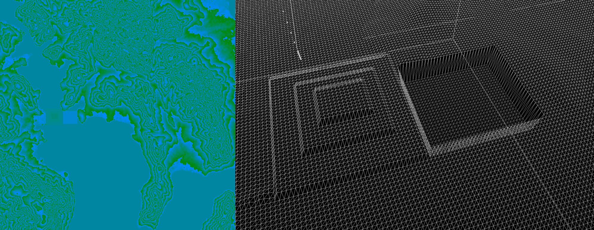

For the sake of time we're going to haphazardly assume anything below sea level (0) is water, which won't work everywhere ([list of places on land with elevations below sea level](https://en.wikipedia.org/wiki/List_of_places_on_land_with_elevations_below_sea_level)).

### Converting lat/lons to x/y Tile Coordinates

Now with a set of real-world lat/lon coordinates, we need to find the appropriate tile and pixels in that tile to modify. How do we do it? I knew it was possible given the initial conversion of bounding box to map tiles, and having to calculate what tiles need to render when rotating / pitching a 3d web map, but I ended up going around in circles like a complete [drongo](https://en.wikipedia.org/wiki/Drongo#Insult)... Stuff I looked at first:

 - [OSM's methods](https://wiki.openstreetmap.org/wiki/Slippy_map_tilenames) on their wiki (which is superb).
 - Leaflet's [project/unproject](https://github.com/Leaflet/Leaflet/blob/master/src/geo/projection/Projection.SphericalMercator.js) and [transform](https://github.com/Leaflet/Leaflet/blob/master/src/geometry/Transformation.js) methods...
 - ... and mapbox-gl's equivalent...
 - ... and [mapbox-gl-native](https://github.com/mapbox/mapbox-gl-native)'s equivalant.
 - Using haversine formula to map lat/lon distance to top of tile and left of tile, then transforming x/y pixel coords from that using resolution per pixel of the tile (*bad bad bad bad bad bad*).

... As it turns out, there's a helpful Mapbox library [@mapbox/tilebelt](https://github.com/mapbox/tilebelt) with a bunch of great methods for map tiles that solves this question with ease! I ended up going with something similar:

```js
const DEG2RAD = Math.PI / 180.0;
const EARTH_RADIUS_M = 6378137;
const LATITUDE_MAX = 85.051128779806604;
const PIXEL_ORIGIN = { x: 1906658, y: 1325278 }; // From Leaflet for EPSG:3857

function getScale (z) {
	return 256 * Math.pow(2, z);
}

function project (lon, lat) {
	lat = Math.max(Math.min(LATITUDE_MAX, lat), -LATITUDE_MAX);
	const sin = Math.sin(lat * DEG2RAD);
	return {
		x: EARTH_RADIUS_M * lon * DEG2RAD,
		y: EARTH_RADIUS_M * Math.log((1 + sin) / (1 - sin)) / 2
	}
}

// https://stackoverflow.com/questions/40986573/project-leaflet-latlng-to-tile-pixel-coordinates
function lonLatToTilePixel (lon, lat, z, tileSize=256) {
	const point = project(lon, lat);

	// Perform affine transformation for EPSG:3857
	const scale = getScale(z);
	const coefficient = 0.5 / (Math.PI * EARTH_RADIUS_M);
	point.x = scale * (coefficient * point.x + 0.5);
	point.y = scale * (-coefficient * point.y + 0.5);

	const tile = {
		x: Math.floor(point.x / tileSize),
		y: Math.floor(point.y / tileSize)
	}

	const tileCorner = {
		x: tile.x * tileSize - PIXEL_ORIGIN.x,
		y: tile.y * tileSize - PIXEL_ORIGIN.y
	}

	return {
		tile,
		x: Math.round(point.x - PIXEL_ORIGIN.x - tileCorner.x),
		y: Math.round(point.y - PIXEL_ORIGIN.y - tileCorner.y)
	}
}

// Get target tile coord, and transform lon/lat to x/y pixels in that tile
// z - 1 due to tilesize diff (https://wiki.openstreetmap.org/wiki/Zoom_levels)
const { tile, x, y } = lonLatToTilePixel(lon, lat, z-1, 512);
```

---

## Finding Bathymetry Data

One pixel at a time is nice and all, but not so practical. Let's get some data to use, to modify multiple pixels.

There is some detailed bathy data served up by ArcGIS available on [LISTmap](https://maps.thelist.tas.gov.au/listmap/app/list/map), processed via the following:

 - Navigate ArcGIS' API throwing uninformative 400 errors for empty/invalid fields
 - Write script to download all features
 - Write script to merge and re-label features
 - Draw quick area of focus bbox with [geojson.io](https://geojson.io)
 - Write nasty point-in-polygon script to remove all features outside of that bbox (ArcGIS server was throwing useless errors trying to do this via the API)
 - We're left with a pretty straightforward [geojson file](https://github.com/vulkd/hydroxy/blob/master/util/example-depth-data.geojson).

*Note: The [SS Lake Illawarra](https://en.wikipedia.org/wiki/SS_Lake_Illawarra)'s shipwreck resides in the area of the tile I've been using (it collided with a bridge pylon). As such there’s been a few dives on it for various purposes. The Aussie science organization CSIRO have done [surveys](https://www.youtube.com/watch?v=p97d6U6kNxY). It would be cool to find some multibeam data (CSIRO's never got published to the web afaik, though could email them) and mix it with threejs.*

---

## Hydroxy and Redis

Now I want to be able to load new areas of the map, without having to generate every tile beforehand. To do this we can go through `example-depth-data.geojson` and convert those coords to x/y positions on their corresponding map tile coordinates. Simply loop through the coordinates, get each one's depth somehow, convert them to tile coordinates and store them in Redis with the key being their slippy map tile coordinate.
 - Key: `z:y:x`
 - Value: `[{x, y, z}, {x, y, z}, ...etc]`

When a tile is requested from the [proxy server](https://github.com/vulkd/hydroxy/blob/master/hydroxy.js), download the tile from Mapbox and check if the tile's z/y/x coordinate is in Redis. If it is, use the stored value(s) to modify the tile and cache it for later use. Cache busting could be set in the client (eg; route query) or server (eg; check Redis value for changes, keep track of tile's last edited timestamp(s)) to reflect additional changes to each tile.

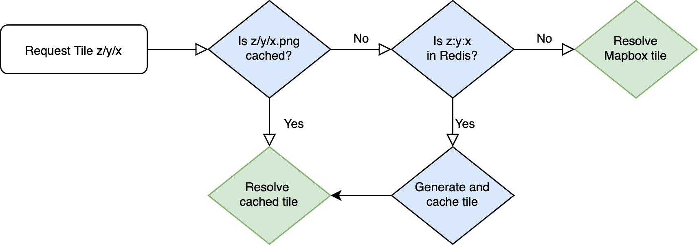

---

## Drawing Bathymetry Data

Now, with some co-ordinates, we can plot the resulting GeoJSON with the [previous script](https://github.com/vulkd/hydroxy/blob/master/generatePixelCoords.js)!

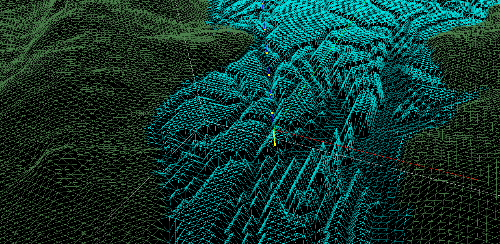

*Note: There are two things to be aware of when using bathy data likes this. First are the aforementioned locations below sea-level. A check could be put in place for those locations, though there's bound to be anomalies. Second, some bathymetric data measures riverbeds, lakes, etc. and a check needs to be made so as to not plot a 10-meter deep mountain river as 10 meters below the ocean (eg if elevation is greater than sea level don't render it).*

---

## Fixing Blank Spots

Due to the nature of bathymetric surveys we're often left with plenty of areas with an unknown depth. There are suitable methods for interpolating bathymetry data:

 - https://journals.plos.org/plosone/article/file?id=10.1371/journal.pone.0216792&type=printable
 - https://gis.stackexchange.com/questions/210223/which-interpolation-technique-is-suitable-for-a-bathymetry-of-a-small-lake
 - https://pubs.er.usgs.gov/publication/ofr8928
 - https://agupubs.onlinelibrary.wiley.com/doi/pdf/10.1029/2018EA000539
 - https://www.researchgate.net/post/Is_IDW_suitable_when_interpolating_bathymetry_out_of_echo_sounder_data

At the moment I'm just taking polylines and converting them to polygons with the same depth value, and layered them to draw the deeper areas last. So not accurate, just a neat aesthetic at this stage! Here's some of the bathy data drawn onto a canvas and filled in with a polygon fill algorithm to illustrate the problem of not having closed linestrings (magenta is where top-down fill stops):

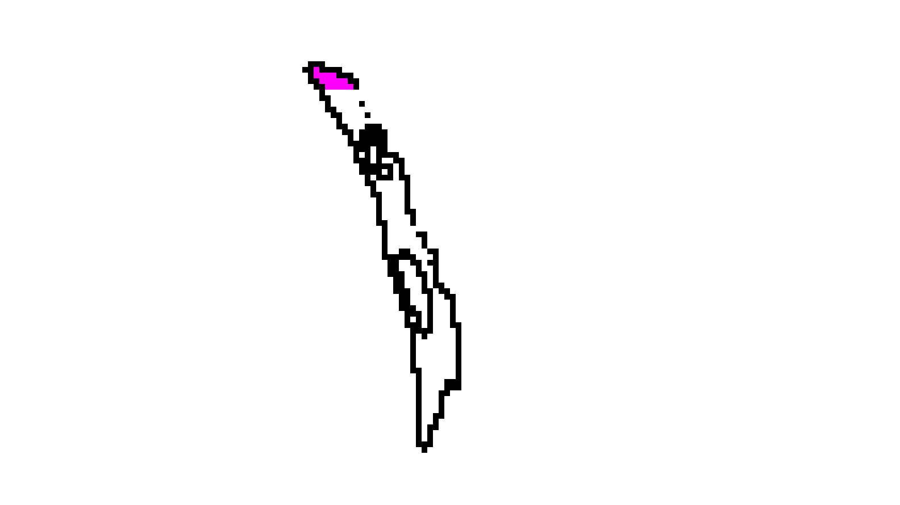

Connecting each vertice of each polygon with a [line drawing algorithm](https://en.wikipedia.org/wiki/Bresenham%27s_line_algorithm) gives us a closed loop we can [fill in](https://alienryderflex.com/polygon_fill/), giving us a modified tile with nicer looking results:

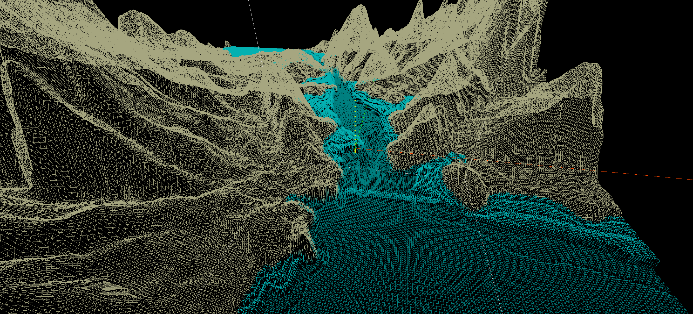

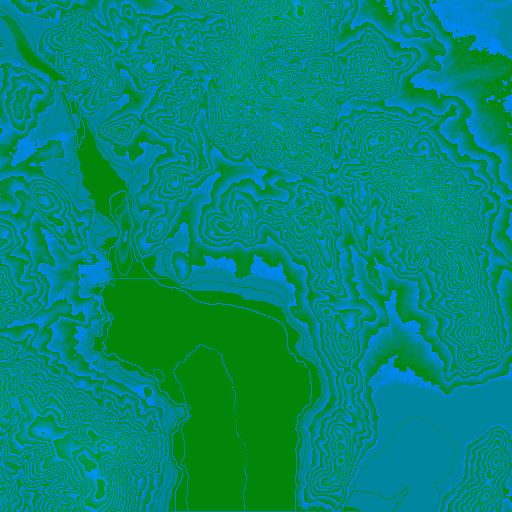

---

## Miscellaneous

 - Kinda want to build a [DIY ROV](http://www.homebuiltrovs.com) now.
 - It would be amazing to render a ROV or ship's position, render each multibeam scan, and update bathymetry all in real time.
 - I recommend trying an expotential function to exaggerate height a little more at greater elevations for artistic purposes.
 - Simply softening an image and increasing it's exposure resulted in some pretty sweet - if inaccurate - contours:

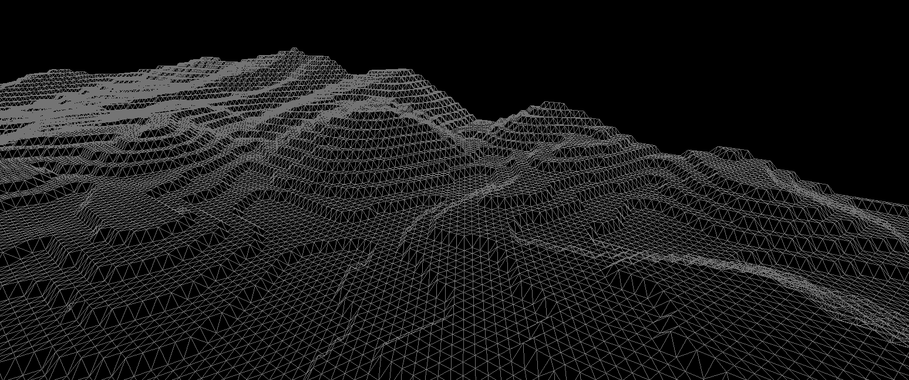

### Modifying the Wireframe Shader

To visually differentiate land / water later on, I wrote my first shader to change the colour of the wireframe material depending on height. A few people have convinved me to look at WebGL sans-threejs which should be interesting and would give a more thorough understanding of how threejs works:

```js
new THREE.ShaderMaterial({
	wireframe: true,
	fragmentShader: `
		varying vec3 vColor;

		void main() {
			gl_FragColor.rgb = vColor;
		}
	`,
	vertexShader: `
		varying vec3 vColor;
		float h;

		void main() {
			h = position.z;

			if (h == 0.0) {
				vColor = vec3(0.0, 0.9, 0.9);
			} else if (h < 0.0) {
				vColor = vec3(0.0, clamp(h, 0.5, 0.8), clamp(h, 0.5, 0.8));
			} else {
				vColor = vec3(0.65, 0.6, 0.4);
			}

			vec4 modelViewPosition = modelViewMatrix * vec4(position, 1.0);
			gl_Position = projectionMatrix * modelViewPosition;
		}
	`,
});
```

### Underwater Positioning Systems
 - https://en.wikipedia.org/wiki/Underwater_acoustic_positioning_system
 - https://ieeexplore.ieee.org/document/1405510
 - https://www.asiatimes.com/2019/10/article/little-aussie-sub-creates-3d-underwater-maps/
 - https://waterlinked.com/product/underwater-gps-explorer-kit/
 - https://www.businessinsider.com.au/uam-tec-submarine-google-street-view-2019-10
 - https://www.ncbi.nlm.nih.gov/pmc/articles/PMC4732074/
 - https://www.researchgate.net/publication/309063343_Smart_Underwater_Positioning_System_and_Simultaneous_Communication
 - https://www.youtube.com/watch?v=bU57kKsfjDY

### Misc Bathymetry Links
 - https://schmidtocean.org/technology/seafloor-mapping/
 - https://ieeexplore.ieee.org/document/1002376