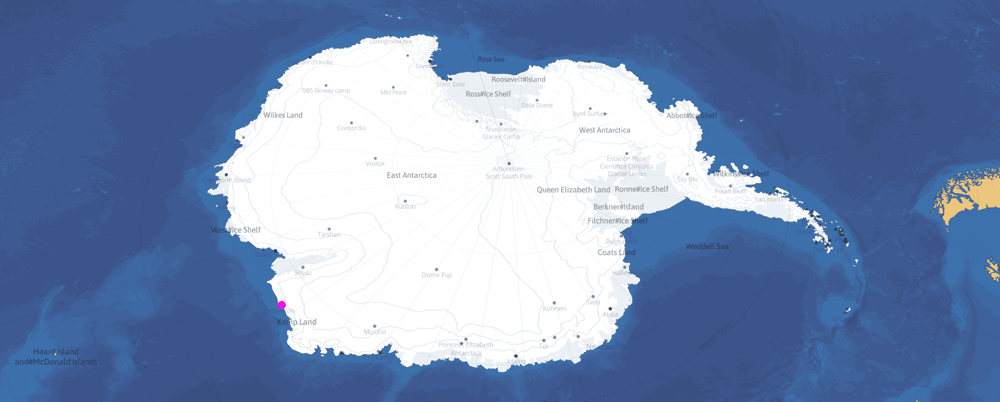
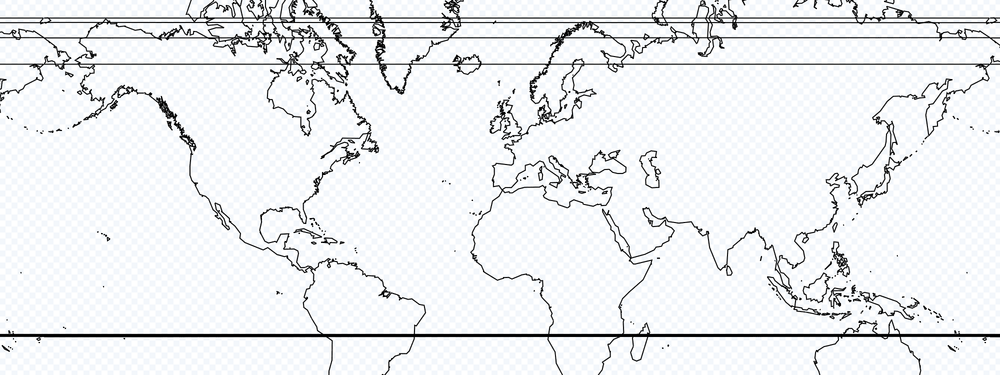
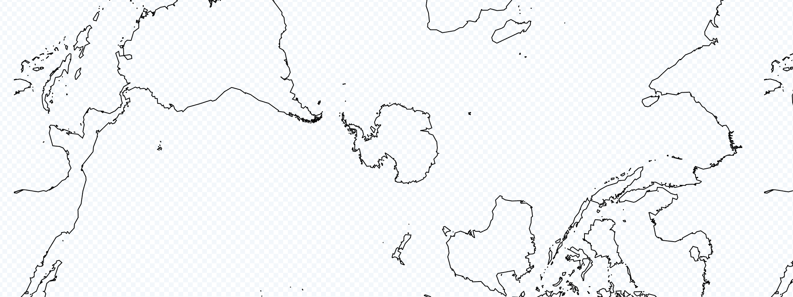
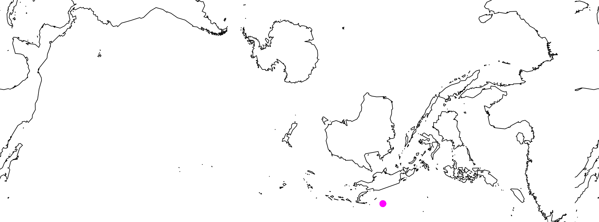
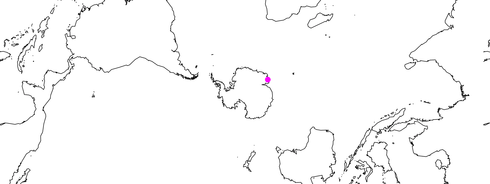
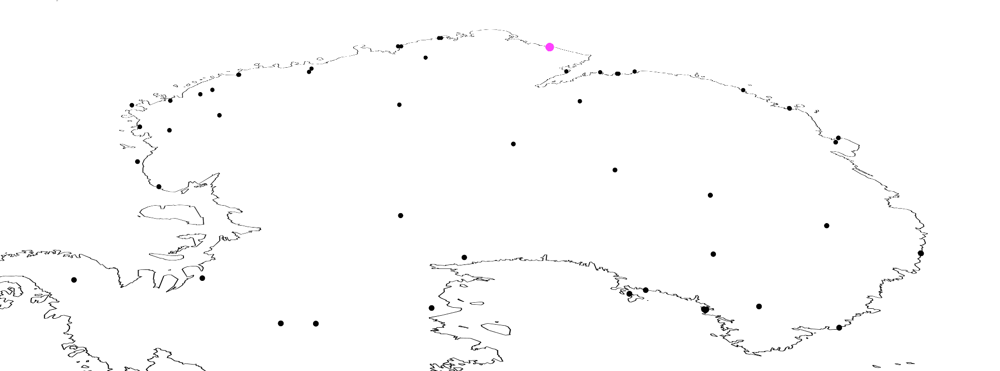

/// include_map

<!--  -->

# Polar Projections with Mapbox
*January 2020*

*Note: Right click and drag to rotate.*

/// tos

There are various [map projections](https://en.wikipedia.org/wiki/List_of_map_projections). As of December 2019 [Mapbox only supports EPSG:3857](https://docs.mapbox.com/help/glossary/projection/). Some workarounds include one created by Matthew Irwin in his *[Mapping Arctic sea ice in a polar projection](https://blog.mapbox.com/mapping-arctic-sea-ice-in-a-polar-projection-a8fd68a03c53)* article, which uses a polar stereographic projection for the North Pole ([EPSG:3995](https://epsg.io/3995)). We'll go through the process of implementing a similar one, only using a projection for the South Pole ([EPSG:3031](https://epsg.io/3031)).

Read more about [stereographic systems on Wikipedia](https://en.wikipedia.org/wiki/Universal_polar_stereographic_coordinate_system). If you've ever had to navigate with a paper map it's likely that you've used a similar coordinate system, just in [transverse](https://en.wikipedia.org/wiki/Universal_Transverse_Mercator_coordinate_system).

*Note: Shortly after this was written a Mapbox developer implemented a different projection using a similar technique, with perhaps some more accessible tooling (no GDAL!). Check it out [here](https://blog.mapbox.com/mapping-the-us-elections-guide-to-albers-usa-projection-in-studio-45be6bafbd7e)*.

### Requirements:
 - [GDAL](https://gdal.org/).
 - A [Mapbox](https://www.mapbox.com) account.
 - Basic knowledge of shell commands, HTML, and JS.

## Prepare the Data

First we're going to need some data in our desired projection. Natural Earth has a bunch of datasets in the public domain. We're going to be using their [10m coastline shapefile](http://www.naturalearthdata.com/downloads/10m-physical-vectors/10m-coastline/). Download and transform/reproject that shapefile to EPSG:3031 using GDAL's [ogr2ogr](https://gdal.org/programs/ogr2ogr.html) with the *t_srs* option:

```bash
wget https://www.naturalearthdata.com/http//www.naturalearthdata.com/download/10m/physical/ne_10m_coastline.zip

unzip ne_10m_coastline.zip && cd ne_10m_coastline

ogr2ogr -t_srs EPSG:3031 reprojected.shp ne_10m_coastline.shp
```

At the moment, if we upload the shapefile Mapbox will attempt to read it as EPSG:3857:



We can use a bit of subterfuge and assign a new projection to the shapefile without actually transforming it. That way Mapbox won't attempt to reproject it. Just imagine you're the leader of the Greek army and Mapbox is the [city of Troy](https://en.wikipedia.org/wiki/Trojan_Horse).

Let's modify the shapefile again and assign the CRS to assign EPSG:3857 using ogr2ogr's *a_srs* option, and zip up the resulting files:

```bash
ogr2ogr -a_srs EPSG:3857 reprojected_3857.shp reprojected.shp

zip polar_coast.zip reprojected_3857.*
```

Now [create a new tileset](https://docs.mapbox.com/studio-manual/reference/tilesets) in Mapbox Studio, and upload *polar_coast.zip* as the dataset. Wait for it to finish uploading and processing, then create a new *basic* style. Add a new layer to the style and specify *polar_coast* as the source, and ensure *Line* is the source type. It should look something like this:



## Add to *mapbox-gl-js*

Add the [style URL](https://docs.mapbox.com/studio-manual/overview/publish-your-style) to your mapbox-gl.js setup, replacing *your_access_token* and *your_style_url* accordingly:

```html
<!DOCTYPE html>
<html>
<head>
    <meta charset='utf-8'/>
    <meta name='viewport' content="initial-scale=1,maximum-scale=1,user-scalable=no'/>
    <script src='https://api.tiles.mapbox.com/mapbox-gl-js/v1.6.1/mapbox-gl.js'></script>
    <link href='https://api.tiles.mapbox.com/mapbox-gl-js/v1.6.1/mapbox-gl.css' rel='stylesheet'/>
    <style>
        body { margin: 0; padding: 0; }
        #map { position: absolute; top: 0; left: 0; width: 100%; height: 100%; }
    </style>
</head>
<body>
    <div id='map'></div>
    <script>
        mapboxgl.accessToken = 'your_access_token';

        const map = new mapboxgl.Map({
            container: 'map',
            style: 'your_style_url'
        });
    </script>
</body>
</html>
```

## Working with Dynamic Data

Great - vector tiles should now be working! However, mapbox-gl-js is *still* using it's default coordinate system. Not much we can do about that besides submit a PR!

Add [Mawson Station](https://en.wikipedia.org/wiki/Mawson_Station) to the map at [62.87417, -67.603232]:

```js
map.on('load', () => {
    map.addLayer({
        'id': 'mawson-station',
        'type': 'circle',
        'source': {
            'type': 'geojson',
            'data': {
                'type': 'Feature',
                'geometry': {
                    'type': 'Point',
                    'coordinates': [62.87417, -67.603232]
                }
            }
        },
        'paint': {
            'circle-color': '#f0f',
            'circle-radius': 6
        }
    });
});
```



Doesn't seem like the correct location... [proj4](http://proj4js.org) to the rescue! It can transform coordinates for us clientside. Keep in mind this incurs a very real performance cost. Perhaps you can figure out a way to minimize this. Here's a CDN script for proj4:

```html
<script
    src='https://cdnjs.cloudflare.com/ajax/libs/proj4js/2.6.0/proj4.js'
    integrity='sha256-GfiEM8Xh30rkF6VgCIKZXLhoPT8hWwijiHkiKeJY82Y='
    crossorigin='anonymous'
></script>
```

Mapbox uses EPSG:3857, which is predefined in the proj library. We can find proj definitions on sites like [epsg.io](http://epsg.io/) and [spatialreference.org](https://www.spatialreference.org/). To manually define one, pass an alias of your choosing as the first argument, and the definition as the second:

```js
proj4.defs('EPSG:3031', '+proj=stere +lat_0=-90 +lat_ts=-71 +lon_0=0 +k=1 +x_0=0 +y_0=0 +datum=WGS84 +units=m +no_defs');
```

First transform the coordinate to our desired projection. Then transform the result from our *display* projection (Mapbox's web mercator projection, EPSG:3857), to standard lat/lon geographic coordinates EPSG:4326 (which is also predefined in proj):

```js
const reprojectCoord = (coord, crs) => proj4('EPSG:3857', 'EPSG:4326', proj4(crs, coord));

...
'geometry': {
    'type': 'Point',
    'coordinates': reprojectCoord([62.87417, -67.603232], 'EPSG:3031')
}
...
```



Leaflet, mapbox-gl-js, Google Maps, etc. all eventually [transform values to a flat system](https://www.maptiler.com/google-maps-coordinates-tile-bounds-projection/) for the ability to paint pixels at x/y coordinates for display on our screens. Mapbox accepts our lat/lon coords, and then changes them with [a bunch of math](https://github.com/mapbox/mapbox-gl-js/blob/master/src/geo/transform.js). We need to work around this process somehow, henceforth doing the following:
 - Take a lat/lon point at Mawson that displays fine with a normal Mapbox layer.
 - Reproject that with proj to EPSG:3031 so it matches up with the stereographic layer.
 - mapbox-gl-js will treat it as EPSG:3857 and place it at the same location as before.
 - Reproject it again to EPSG:4326, only read the EPSG:3031 point as EPSG:3857.
 - Results in coords that display incorrectly on a normal layer, but perfectly for the EPSG:3031 layer.

### fill-extrusion layers, mapbox-gl-draw, and other libraries:

*fill-extrusion* layers work fine, the z-axis isn't affected in this context. Note that any mapbox-gl-js libraries won't be aware of different coordinate systems, and you'll have to reproject coords when using them. Again, performance cost.

## Converting GeoJSON with ogr2ogr

If you're displaying static geojson data [like so](https://docs.mapbox.com/mapbox-gl-js/example/geojson-markers/), it can be efficient to pre-emptively reproject it using [this method by Andrew Harvey](https://gis.stackexchange.com/questions/262104/working-with-polar-projections-in-mapbox) - Demonstrated here with COMNAP data available from the [Polar Geospatial Center](https://github.com/PolarGeospatialCenter/comnap-antarctic-facilities). The commented coords are [Belgrano 2](https://en.wikipedia.org/wiki/Belgrano_II_Base)'s. Keep in mind specifying a crs in the current geojson spec is [deprecated](https://tools.ietf.org/html/rfc7946), so feel free to remove it from the final result.

```bash
cat COMNAP_Antarctic_Facilities_Master.json  | grep crs
# ...urn:ogc:def:crs:OGC:1.3:CRS84...

cat COMNAP_Antarctic_Facilities_Master.json  | grep Belgrano
# ...[ -34.627778, -77.873889 ]...

ogr2ogr -f GeoJSON -t_srs "EPSG:3031" reprojected_3031.geojson COMNAP_Antarctic_Facilities_Master.json
# urn:ogc:def:crs:EPSG::3031
# [ -751371.907592372968793, 1088046.646264940965921 ]

ogr2ogr -f GeoJSON -a_srs 'EPSG:3857' reprojected_3857.geojson reprojected_3031.geojson
# urn:ogc:def:crs:EPSG::3857
# [ -751371.907592372968793, 1088046.646264940965921 ]

ogr2ogr -f GeoJSON -t_srs 'EPSG:4326' reprojected_4326.geojson reprojected_3857.geojson
# urn:ogc:def:crs:OGC:1.3:CRS84
# [ -6.749688686482691, 9.727025422232318 ]
```



*Note: You may come across a [CORS error](https://en.wikipedia.org/wiki/Cross-origin_resource_sharing) while trying to load a geojson file from a local directory. To save you the hassle, here's a quick fix. Serve the file by running the following python(3) script in the same directory as our geojson file, and using 127.0.0.1:5555/file.geojson as the source url.*

```python
from http.server import SimpleHTTPRequestHandler
from socketserver import TCPServer

class handler(SimpleHTTPRequestHandler):
    def send_head(self):
        path = self.translate_path(self.path)
        self.send_response(200)
        self.send_header('Content-type', 'application/json')
        self.send_header('Access-Control-Allow-Origin', '*')
        self.end_headers()
        return open(path, 'rb')

httpd = TCPServer(('127.0.0.1', 5555), handler)
httpd.serve_forever()
```

## Miscellaneous

 - [example.html](https://gist.github.com/vulkd/c9595c9d7250c5b818458f304fe14536) is a gist that contains implementations of referenced items in this article.
 - [Colorbrewer](https://github.com/axismaps/colorbrewer) is an often cited tool for picking color ramps for (speciically cloropleth, but useful for other types of data viz) maps.
 - [Here's a python script](https://gist.github.com/vulkd/a13e0e2d8f18addb7697feb39a9c1fad) to extract, reproject, and zip up a directory containing directories of shapefiles. You'll have to modify the *DRY_RUN* variable.

While repetition can work for mercator, it's not so great for stereographic. Setting *renderWorldCopies* to false will disable it, and *maxBounds* will prevent accidentally panning away from the map into oblivion:

```js
const map = new mapboxgl.Map({
    ...
    renderWorldCopies: false,
    maxBounds: [[-180, -80], [180, 80]]
});
```

The feasibility and need for other coordinate reference systems in mapbox-gl-js is currently being discussed on [Github](https://github.com/mapbox/mapbox-gl-js/issues/3184). Have a look at [OpenLayers](https://openlayers.org/en/latest/apidoc/module-ol_proj_Projection-Projection.html) and/or [Leaflet](https://leafletjs.com/reference-1.6.0.html#crs) (see: [Proj4Leaflet](https://github.com/kartena/Proj4Leaflet)) for a more robust approach towards non-standard projections in web mapping libraries.

Please note that the map above is using layers of various resolutions so some of the coastlines clash, and one of the symbolic layers contains a few unformatted labels. Also, the compass isn't quite right, but should be a relatively simple fix!
